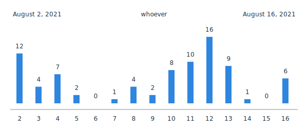

## Sample Generated SVG


Image above was generated by calling:
```
GET /stats.svg?login=whoever&date=2021-08-16&days=15
```

## How to Test
Make sure you have setup mongodb and configure MONGO_URL and MONGO_DATABASE environment variables with correct value.
You can use dockerized mongodb like this one:
```sh
# this mongodb does not associated with any volume
# data will be destroyed when the container is removed
docker run mongo:latest --rm -p "27017:27017"
```

Then run the test command:
```sh
npm test
```
